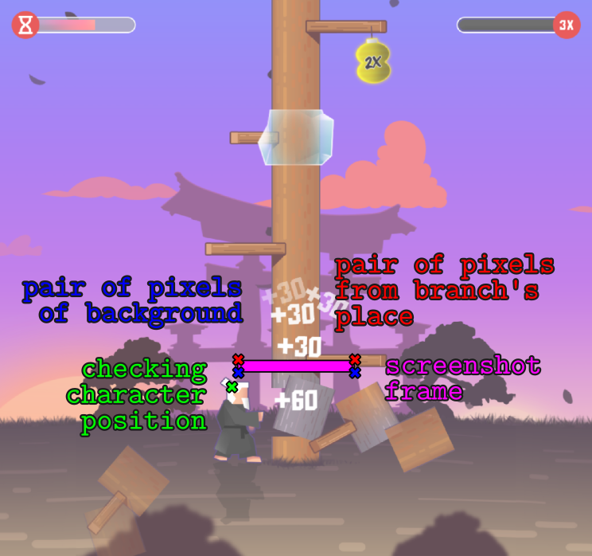

## Woodcutter Game Bot

There is my bot in this repository, it has reached a score of 231k points in the Karate Kido 2. Yes, a perfect bot will score an unlimited number of points, but my task was just to practice graphic cheating. Many approaches to recognizing what is happening on the screen have been tried, but the following has shown its reliability.

The complexity of the task is that some logs are not "cut down" from the first touch, so it is not so easy to recognize 8 rows of branches at once, determining which ones are safe among them, and from which side. It was decided to effectively answer the question "Is there a branch directly above the character's head?", and make decisions based on this.

## Algorithm (look at the picture below):
1. Check the green pixel, determining which side the character is on now (this check must be performed, since some bonuses change the position of the character randomly);
2. Take a screenshot of the pink area of the screen;
3. Look at that red-blue pair of pixels, which is from the side of the character;
4. If the colors of the two pixels are not enouth similar, then we decide that there is a branch above the character (many variations of branch detecting have been tried here, up to a specific color in the screen area);
5. Make "tap" at the safe side of the tree (in case of changing the side "tap" can be done twice at once)
6. Repeat until we see the loss screen

